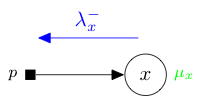

Implementation
==============

Separable prior
---------------

.. currentmodule:: tramp.priors

A prior has one output variable here denoted $x$. In a message passing
context, for instance in expectation propagation or state evolution, it receives
a natural parameter message $\lambda_x^-$ coming from $x$ and returns a
moment $\mu_x$.

We detail below how to derive mathematically, and implement concretely in Tree-AMP,
a prior for:

1. :ref:`prior_sampling`
2. :ref:`prior_EP`
3. :ref:`prior_second_moment`
4. :ref:`prior_SE`

All priors share the same implementation, however
:ref:`map_priors` and :ref:`committee_priors`
require some special handling. Please consult the revelant section if need be.

.. tip::
  When you create a new prior, you do not have to implement all the methods
  simultaneously. If you want to postpone the mathematical derivation or
  implementation just raise an :exc:`NotImplementedError` in the
  corresponding method.

.. _prior_sampling:

Sampling
^^^^^^^^

A prior is implemented in Tree-AMP as a subclass of the base :class:`Prior`
class. The constructor :meth:`prior.__init__` must contain as parameters:

- the ``size`` which corresponds to the shape of the variable $x$,
- the ``isotropic`` flag for isotropic/diagonal beliefs in EP,
- additional parameters needed to specify the prior.

See the :class:`GaussBernoulliPrior` class, both its documentation and source code,
for an example.

.. nbplot::
  >>> from tramp.priors import GaussBernoulliPrior
  >>> prior = GaussBernoulliPrior(size=100)
  >>> print(prior)
  GaussBernoulliPrior(size=100,rho=0.5,mean=0,var=1,isotropic=True)

The :meth:`prior.sample` method takes no arguments and must return a sample $x$
of shape ``size`` from the prior.

.. nbplot::
  >>> import matplotlib.pyplot as plt
  >>> # sample x
  >>> x = prior.sample()
  >>> assert x.shape == (100,)
  >>> # plot x
  >>> fig, axs = plt.subplots(1, 1, figsize=(8, 4))
  >>> axs.plot(x, '.')
  >>> axs.set(title=f"x ~ {prior}", ylim=(-3, 3));

.. _prior_EP:

Expectation propagation
^^^^^^^^^^^^^^^^^^^^^^^

.. note::
  We are only considering separable priors $p(x) = \prod_{i=1}^{N_x} p(x^{[i]})$
  in this section. For an example of a non separable prior
  see the :ref:`map_L21_prior` prior.

Scalar quantities
"""""""""""""""""

The scalar EP log-partition, mean and variance are given by:

.. math::
  A_p[a_x^-,b_x^-] = \ln \int dx \, p(x) \,
  e^{-\frac{1}{2} a_x^- x^2 + b_x^- x} , \quad
  r_x[a_x^-,b_x^-] = \partial_{b_x^-}    A_p[a_x^-,b_x^-] , \quad
  v_x[a_x^-,b_x^-] = \partial^2_{b_x^-}  A_p[a_x^-,b_x^-] ,

and are implemented in Tree-AMP as the methods:

- :meth:`prior.scalar_log_partition` for $A_p[a_x^-,b_x^-]$,
- :meth:`prior.scalar_forward_mean` for $r_x[a_x^-,b_x^-]$,
- :meth:`prior.scalar_forward_variance` for $v_x[a_x^-,b_x^-]$.

As a sanity check, you can use :func:`tramp.checks.plot_prior_grad_EP`
to check the gradients $r_x = \partial_{b_x^-}  A_p$,
$v_x = \partial^2_{b_x^-}  A_p$ and $\tau_x = r_x^2 + v_x = -2 \partial_{a_x^-} A_p$.

.. nbplot::
  >>> from tramp.checks import plot_prior_grad_EP_scalar
  >>> plot_prior_grad_EP_scalar(prior)

Diagonal beliefs
""""""""""""""""""

During expectation propagation, when using diagonal beliefs
``prior.isotropic=False``, the prior receives the natural parameter message
$\lambda_x^-=b_x^- a_x^-$ and returns the moment $\mu_x = r_x v_x$
where $b_x^-$, $a_x^-$, $r_x$ and $v_x$ are all arrays of the same shape
``size`` as the variable $x$. For a separable prior, the corresponding
log-partition, mean and variance vectorize their scalar counterparts:

.. math::
  A_p[a_x^-,b_x^-] = \frac{1}{N_x} \sum_{i=1}^{N_x} A_p[a_x^{-[i]},b_x^{-[i]}], \quad
  r_x^{[i]}[a_x^-,b_x^-] = r_x[a_x^{-[i]},b_x^{-[i]}], \quad
  v_x^{[i]}[a_x^-,b_x^-] = v_x[a_x^{-[i]},b_x^{-[i]}],

and are implemented in Tree-AMP by the methods:

- :meth:`prior.compute_log_partition` for $A_p[a_x^-,b_x^-]$,
- :meth:`prior.compute_forward_posterior` for $r_x[a_x^-,b_x^-]$ and $v_x[a_x^-,b_x^-]$.

Actually only the vectorized versions are used in EP. However it is useful to
also provide the scalar versions which are used in SE and in the gradient checking.

Isotropic beliefs
"""""""""""""""""

When using isotropic beliefs ``prior.isotropic=True``, the
only difference is that the precision $a_x^-$ and variance $v_x$ are scalars
instead of vectors. For the implementation, this means that
:meth:`prior.compute_forward_posterior` must return the scalar variance
$v_x = \frac{1}{N_x} \sum_{i=1}^{N_x} v_x^{[i]}$ averaged over components when
``prior.isotropic=True``.

Tests
"""""

If you implement a new prior for EP, please add it to the test suite
:mod:`tramp.tests.test_priors` to make sure that it passes
the vectorization :func:`test_separable_prior_vectorization` and the gradient
checking :func:`test_prior_grad_EP_scalar`.

.. _prior_second_moment:

Second moment
^^^^^^^^^^^^^

Factor graph
""""""""""""

When the teacher generative model is a factor graph,
the prior log-partition and second moment are given by:

.. math::
  A_p[\hat{\tau}_x^-] = \ln \int dx \, p(x) \,
  e^{-\frac{1}{2} \hat{\tau}_x^- x^2 } , \quad
  \tau_x[\hat{\tau}_x^-] = - 2 \partial_{\hat{\tau}_x^-}  A_p[\hat{\tau}_x^-] ,

and are implemented in Tree-AMP by the methods:

- :meth:`prior.prior_log_partition_FG` for $A_p[\hat{\tau}_x^-]$,
- :meth:`prior.forward_second_moment_FG` for $\tau_x[\hat{\tau}_x^-]$.

The prior log-partition is easily obtained from the scalar EP one
$A_p[\hat{\tau}_x^-] = A_p[a_x^- = \hat{\tau}_x^-, b_x^- =0]$ and the
:meth:`prior.prior_log_partition_FG` method is already
implemented in the base :class:`Prior` class.
When you create a new prior, you therefore only need to implement the
:meth:`prior.forward_second_moment_FG` method.

As a sanity check, you can use :func:`tramp.checks.plot_prior_grad_FG`
to check the gradient $\tau_x = -2 \partial_{\hat{\tau}_x^-} A_p$.

.. nbplot::
  >>> from tramp.checks import plot_prior_grad_FG
  >>> plot_prior_grad_FG(prior)

Bayesian network
""""""""""""""""

When the teacher generative model is a Bayesian network,
we have $\hat{\tau}_x^- =0$. Then the prior second-moment is simply given by:

.. math:: \tau_x = \mathbb{E}_{p(x)} x^2

and is implemented in Tree-AMP by the method :meth:`prior.second_moment`.

Tests
"""""

If you implement a new prior, please add it to the test suite
:mod:`tramp.tests.test_priors` to make sure that it passes the gradient
checking :func:`test_prior_grad_FG`.

.. _prior_SE:

State evolution
^^^^^^^^^^^^^^^

.. _prior_RS:

Replica symmetric
"""""""""""""""""

In the replica symmetric but mismatched case, the teacher generative
model (a factor graph) will differ from the student one by some of its factors.
In particular the teacher prior $p^{(0)}(x)$ can be different from the student prior
$p(x)$. The ensemble average log-partition (free entropy), overlap $m_x$,
self-overlap $q_x$ and variance $v_x$ are given by:

.. math::
  &A_p[\hat{m}_x^-,\hat{q}_x^-,\hat{\tau}_x^-] =
  \mathbb{E}_{ p^{(0)}(x, b_x^-) } \, A_p[a_x^-,b_x^-] ,\\
  &m_x[\hat{m}_x^-,\hat{q}_x^-,\hat{\tau}_x^-] =
  \mathbb{E}_{ p^{(0)}(x, b_x^-) } \, x r_x[a_x^-,b_x^-] ,\\
  &q_x[\hat{m}_x^-,\hat{q}_x^-,\hat{\tau}_x^-] =
  \mathbb{E}_{ p^{(0)}(x, b_x^-) } \, r_x^2[a_x^-,b_x^-] ,\\
  &v_x[\hat{m}_x^-,\hat{q}_x^-,\hat{\tau}_x^-] =
  \mathbb{E}_{ p^{(0)}(x, b_x^-) } \, v_x[a_x^-,b_x^-] ,

with $a_x^- = \hat{q}_x^- + \hat{\tau}_x^-$ and

.. math::
  p^{(0)}(x, b_x^-) = p^{(0)}(x ; \hat{\tau}_x^{-(0)})
  \mathcal{N}(b_x^- | \hat{m}_x^- x, \hat{q}_x^-) , \quad
  p^{(0)}(x ; \hat{\tau}_x^{-(0)} ) = p^{(0)}(x) e^{
    -\frac{1}{2} \hat{\tau}_x^{-(0)} x^2 - A_{p^{(0)}}[\hat{\tau}_x^{-(0)}]
  } ,

and are already implemented in the base :class:`Prior` class as the methods:

- :meth:`prior.compute_potential_RS` for $A_p[\hat{m}_x^-,\hat{q}_x^-,\hat{\tau}_x^-]$,
- :meth:`prior.compute_forward_vmq_RS` for $v_x[\hat{m}_x^-,\hat{q}_x^-,\hat{\tau}_x^-]$, $m_x[\hat{m}_x^-,\hat{q}_x^-,\hat{\tau}_x^-]$ and $q_x[\hat{m}_x^-,\hat{q}_x^-,\hat{\tau}_x^-]$.

However you still need to implement the ensemble average over
$p^{(0)}(x, b_x^-)$ , in the teacher prior class, by the methods:

- :meth:`prior.b_measure` which returns $\mathbb{E}_{p^{(0)}(x, b_x^-)} f(b_x^-)$ for any function $f(b_x^-)$,
- :meth:`prior.bx_measure` which returns $\mathbb{E}_{p^{(0)}(x, b_x^-)} x f(b_x^-)$ for any function $f(b_x^-)$.

During state evolution, the prior receives the natural parameter
message $\lambda_x^- = \hat{m}_x^- \hat{q}_x^- \hat{\tau}_x^-$ and returns the
moments $\mu_x = m_x q_x \tau_x$. Actually in Tree-AMP we parametrize the message
using $a_x^- = \hat{q}_x^- + \hat{\tau}_x^-$ instead of $\hat{\tau}_x^-$ and
we return the variance $v_x$ instead of the second moment $\tau_x = q_x + v_x$.

The moments are conjugate to the natural parameters:

.. math::
  &m_x[\hat{m}_x^-,\hat{q}_x^-,\hat{\tau}_x^-] =
   \partial_{\hat{m}_x^-} A_p[\hat{m}_x^-,\hat{q}_x^-,\hat{\tau}_x^-] , \\
  &q_x[\hat{m}_x^-,\hat{q}_x^-,\hat{\tau}_x^-] =
  -2\partial_{\hat{q}_x^-}  A_p[\hat{m}_x^-,\hat{q}_x^-,\hat{\tau}_x^-] , \\
  &\tau_x[\hat{m}_x^-,\hat{q}_x^-,\hat{\tau}_x^-] =
  -2\partial_{\hat{\tau}_x^-}  A_p[\hat{m}_x^-,\hat{q}_x^-,\hat{\tau}_x^-] .

As a sanity check, you can use :func:`tramp.checks.plot_prior_grad_EP`
to check the gradients $m_x = \partial_{\hat{m}_x^-}  A_p$,
$q_x = -2\partial_{\hat{q}_x^-}  A_p$ and
$\tau_x = -2 \partial_{\hat{\tau}_x^-} A_p$.

.. nbplot::
  >>> from tramp.checks import plot_prior_grad_RS
  >>> from tramp.priors import BinaryPrior
  >>> teacher = BinaryPrior(size=None)
  >>> student = GaussBernoulliPrior(size=None)
  >>> plot_prior_grad_RS(teacher, student)

Bayes-optimal
"""""""""""""

In the Bayes-optimal setting, the teacher generative
model (a factor graph) exactly matches the student one, in particular
the teacher and student priors are identical $p(x) = p^{(0)}(x)$.
In that case, we have several simplications:

.. math::
  \tau_x = \tau_x^{(0)} , \quad
  \hat{\tau}_x^- = \hat{\tau}_x^{-(0)} , \quad
  m_x = q_x = \tau_x^{(0)} - v_x ,  \quad
  \hat{m}_x^- = \hat{q}_x^- = a_x^- - \hat{\tau}_x^{-(0)}.

The ensemble average log-partition (free entropy) and variance $v_x$ are
then given by:

.. math::
  A_p[\hat{m}_x^-] =
  \mathbb{E}_{ p^{(0)}(x, b_x^-) } \, A_p[a_x^-,b_x^-] , \quad
  v_x[\hat{m}_x^-] =
  \mathbb{E}_{ p^{(0)}(x, b_x^-) } \, v_x[a_x^-,b_x^-] ,

and are already implemented in the base :class:`Prior` class as the methods:

- :meth:`prior.compute_potential_BO` for $A_p[\hat{m}_x^-]$,
- :meth:`prior.compute_forward_v_BO` for $v_x[\hat{m}_x^-]$.

However you still need to implement the ensemble average over $p^{(0)}(x, b_x^-)$,
provided by the method :meth:`prior.b_measure`, as in the
:ref:`replica symmetric mismatched <prior_RS>` case.

During state evolution, the prior receives the natural parameter
message $\lambda_x^- = \hat{m}_x^-$ and returns the
moments $\mu_x = m_x$. Actually in Tree-AMP we parametrize the message
using $a_x^- = \hat{m}_x^- + \hat{\tau}_x^{-(0)}$ instead of $\hat{m}_x^-$ and
we return the variance $v_x$ instead of the overlap $m_x = \tau_x^{(0)} - v_x$.

The overlap $m_x$ is conjugate to $\hat{m}_x^-$:

.. math:: m_x[\hat{m}_x^-] = 2 \partial_{\hat{m}_x^-} A_p\hat{m}_x^-]

As a sanity check, you can use :func:`tramp.checks.plot_prior_grad_EP`
to check the gradient $m_x = 2 \partial_{\hat{m}_x^-}  A_p$.

.. nbplot::
  >>> from tramp.checks import plot_prior_grad_BO
  >>> plot_prior_grad_BO(prior)

You can use :func:`tramp.checks.plot_prior_BO_limit` to check the Bayes-optimal
(BO) limit of the replica symmetric (RS) potential.

.. nbplot::
  >>> from tramp.checks import plot_prior_BO_limit
  >>> plot_prior_BO_limit(prior)

Bayes-optimal + Bayesian network
""""""""""""""""""""""""""""""""

In that setting, the teacher generative
model is identical to the student one, and is furthermore a Bayesian network
instead of a generic factor graph. Besides the simplications occuring in
the Bayes-optimal setting, we further have $\hat{\tau}_x^{-(0)} = 0$ as the
generative model is a Bayesian network, therefore:

.. math::
  m_x = q_x = \tau_x^{(0)} - v_x ,  \quad
  \hat{m}_x^- = \hat{q}_x^- = a_x^-.

The ensemble average log-partition (free entropy) $A_p$, variance $v_x$,
overlap $m_x$ and mutual information $I_p$ are then given by:

.. math::
  &A_p[a_x^-] = \mathbb{E}_{ p(x, b_x^-) } \, A_p[a_x^-,b_x^-] , \\
  &v_x[a_x^-] = \mathbb{E}_{ p(x, b_x^-) } \, v_x[a_x^-,b_x^-] , \\
  &m_x[a_x^-] = \tau_x^{(0)} - v_x[a_x^-] , \\
  &I_p[a_x^-] = \frac{1}{2} a_x^- \tau_x^{(0)} - A_p[a_x^-] .

with $p(x, b_x^-) = p(x) \mathcal{N}(b_x^- | a_x^- x, a_x^-)$ and are
already implemented in the base :class:`Prior` class as the methods:

- :meth:`prior.compute_free_energy` for $A_p[a_x^-]$,
- :meth:`prior.compute_forward_error` for $v_x[a_x^-]$,
- :meth:`prior.compute_mutual_information` for $I_p[a_x^-]$,
- :meth:`prior.compute_forward_overlap` for $m_x[a_x^-]$.

However you still need to implement the ensemble average over $p(x, b_x^-)$,
provided by the method:

- :meth:`prior.beliefs_measure` which returns $\mathbb{E}_{p(x, b_x^-)} f(b_x^-)$ for any function $f(b_x^-)$.

The overlap $m_x$ (resp. variance $v_x$) is conjugate to the precision $a_x^-$
for the free entropy potential $A_p$ (resp. mutual information $I_p$):

.. math::
  m_x[a_x^-] = 2 \partial_{a_x^-} A_p[a_x^-], \quad
  v_x[a_x^-] = 2 \partial_{a_x^-} I_p[a_x^-].

As a sanity check, you can use :func:`tramp.checks.plot_prior_grad_BO_BN`
to check the gradients $m_x = 2 \partial_{a_x^-}  A_p$ and
$v_x = 2 \partial_{a_x^-}  I_p$

.. nbplot::
  >>> from tramp.checks import plot_prior_grad_BO_BN
  >>> plot_prior_grad_BO_BN(prior)

You can use :func:`tramp.checks.plot_prior_BN_limit` to check the Bayesian
network (BN) limit of the Bayes-optimal but generic factor graph (FG) potential.

.. nbplot::
  >>> from tramp.checks import plot_prior_BN_limit
  >>> plot_prior_BN_limit(prior)

Tests
"""""

If you implement a new prior for SE, please add it to the test suite
:mod:`tramp.tests.test_priors` to make sure that it passes
the gradient checking :func:`test_prior_grad_RS`, :func:`test_prior_grad_BO`
and :func:`test_prior_grad_BO_BN` as well as the Bayes-optimal limit
:func:`test_prior_BO_limit` and Bayesian network limit
:func:`test_prior_BN_limit`.

.. _map_priors:

MAP priors
^^^^^^^^^^

Proximal operator
"""""""""""""""""

For any factor $f(x)  = e^{-E(x)}$ associated to a
regularization penalty / energy function $E(x)$,
one can use the Laplace method to obtain the MAP approximation to the
log-partition, mean and variance:

.. math::
  A_f[a_x^-,b_x^-] &= - \min_x E(x|a_x^-,b_x^-), \\
  r_x[a_x^-,b_x^-] &= x^* = \mathrm{argmin}_x E(x|a_x^-,b_x^-), \\
  v_x[a_x^-,b_x^-] &= \mathrm{diag} E''(x^*|a_x^-,b_x^-)^{-1}  ,

for $E(x|a_x^-,b_x^-) = E(x)+\frac{1}{2} x \cdot a_x^- x - b_x^- \cdot x$
and where $E''(x|a_x^-,b_x^-)$ denotes the Hessian. These quantities can be expressed as:

.. math::
  A_f[a_x^-,b_x^-] &= \frac{\Vert b_x^-\Vert^2}{2a_x^-} -
  \mathcal{M}_{\tfrac{1}{a_x^-}E}\left( \frac{b_x^-}{a_x^-} \right), \\
  r_x[a_x^-,b_x^-] &=
  \mathrm{prox}_{\tfrac{1}{a_x^-}E}\left( \frac{b_x^-}{a_x^-} \right), \\
  v_x[a_x^-,b_x^-] &=  \frac{1}{a_x^- } \nabla
  \mathrm{prox}_{\tfrac{1}{a_x^-}E}\left( \frac{b_x^-}{a_x^-} \right)

where we introduce the Moreau envelop
$\mathcal{M}_g(y) = \min_x \{g(x) + \tfrac{1}{2}\Vert x-y \Vert^2\}$
and the proximal operator
$\mathrm{prox}_g(y)=\mathrm{argmin}_x \{g(x)+\tfrac{1}{2}\Vert x-y \Vert^2\}$.

Also the mean $r_x$, variance $v_x$ and self-overlap $q_x=r_x^2$ are given by
the gradients:

.. math::
  r_x[a_x^-,b_x^-] = \partial_{b_x^-} A_f[a_x^-,b_x^-], \quad
  v_x[a_x^-,b_x^-] = \partial^2_{b_x^-} A_f[a_x^-,b_x^-], \quad
  q_x[a_x^-,b_x^-] = -2 \partial_{a_x^-} A_f[a_x^-,b_x^-].

.. note::
  For a regular prior $p$ we have $\tau_x = r_x^2 + v_x = -2\partial_{a_x^-} A_p$
  while for a MAP prior $f$ we have $q_x = r_x^2 = -2\partial_{a_x^-} A_f$

.. _map_priors_vectorized:

Vectorized versions
"""""""""""""""""""

The vectorized versions are implemented in Tree-AMP as the methods:

- :meth:`prior.compute_log_partition` for $A_f[a_x^-,b_x^-]$,
- :meth:`prior.compute_forward_posterior` for $r_x[a_x^-,b_x^-]$ and $v_x[a_x^-,b_x^-]$.

As a sanity check, you can use :func:`tramp.checks.plot_prior_grad_EP_diagonal`
to check the gradients $r_x = \partial_{b_x^-}  A_f$ and
$v_x = \partial^2_{b_x^-}  A_f$ for the vectorized versions, as illustrated
here for the :class:`MAP_L21NormPrior` associated to the $\Vert . \Vert_{2,1}$
penalty.

.. nbplot::
  >>> from tramp.checks import plot_prior_grad_EP_diagonal
  >>> from tramp.priors import MAP_L21NormPrior
  >>> L21_prior = MAP_L21NormPrior(size=(2, 100), gamma=3, isotropic=False)
  >>> plot_prior_grad_EP_diagonal(L21_prior)

.. _map_priors_scalar:

Scalar versions
"""""""""""""""

If the penalty is separable $E(x) = \sum_{i=1}^{N_x} E(x^{[i]})$, for example
the $\Vert . \Vert_1$ penalty is separable but not the $\Vert . \Vert_{2,1}$
penalty, you can define the scalar versions:

.. math::
  A_f[a_x^-,b_x^-] &= - \min_x E(x|a_x^-,b_x^-) = - E(x^*|a_x^-,b_x^-), \\
  r_x[a_x^-,b_x^-] &= \mathrm{argmin}_x E(x|a_x^-,b_x^-) = x^* =
  \mathrm{prox}_{\tfrac{1}{a_x^-}E}\left( \frac{b_x^-}{a_x^-} \right) , \\
  v_x[a_x^-,b_x^-] &= \frac{1}{a_x^- }
  \mathrm{prox}^\prime_{\tfrac{1}{a_x^-}E}\left( \frac{b_x^-}{a_x^-} \right) ,

for the scalar function $E(x|a_x^-,b_x^-) = E(x)+\frac{1}{2} a_x^- x^2 - b_x^- x$
and scalar proximal operator. They are implemented in Tree-AMP as the methods:

- :meth:`prior.scalar_log_partition` for $A_p[a_x^-,b_x^-]$,
- :meth:`prior.scalar_forward_mean` for $r_x[a_x^-,b_x^-]$,
- :meth:`prior.scalar_forward_variance` for $v_x[a_x^-,b_x^-]$.

As a sanity check, you can use :func:`tramp.checks.plot_prior_grad_EP_scalar`
to check the gradients $r_x = \partial_{b_x^-}  A_f$,
$v_x = \partial^2_{b_x^-}  A_f$ and $q_x = r_x^2 = -2 \partial_{a_x^-} A_f$,
as illustrated here for the :class:`MAP_L1NormPrior` associated to the
$\Vert . \Vert_1$ penalty.

.. nbplot::
  >>> from tramp.checks import plot_prior_grad_EP_scalar
  >>> from tramp.priors import MAP_L1NormPrior
  >>> L1_prior = MAP_L1NormPrior(size=100)
  >>> plot_prior_grad_EP_scalar(L1_prior)

Tests
"""""

If you implement a new MAP prior for EP, please add it to the test suite
:mod:`tramp.tests.test_priors` to make sure that it passes
the gradient checking :func:`test_prior_grad_EP_scalar` for a separable
penalty or  :func:`test_prior_grad_EP_diagonal` for a non separable one.

.. _committee_priors:

Committee priors
^^^^^^^^^^^^^^^^

.. todo:: Committee priors, covariance / precision matrix between experts
